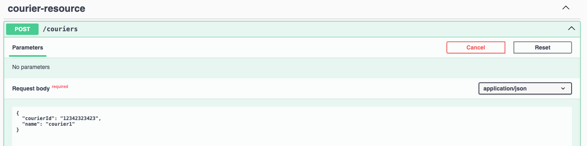
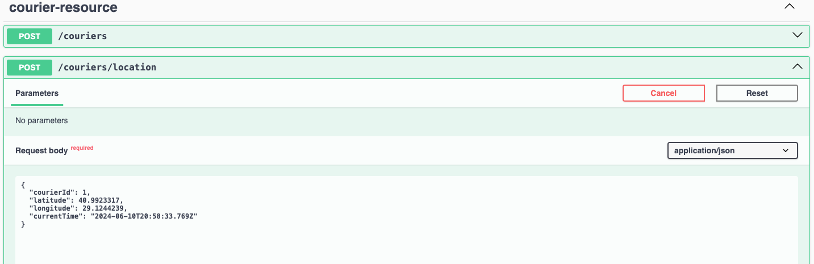
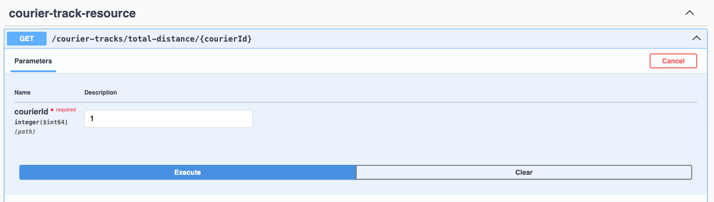

# Courier tracking project

This project is a courier tracking system that records the latitude and longitude of couriers. It allows the creation of
courier profiles and the saving of their locations. If a courier comes within a 100-meter radius of a store, the system
records the courier and store. However, if any courier re-enters the same store's 100-meter radius within 1 minute, the
system does not record this as a new visit. The system also calculates the total distance that each courier has
traveled.

## Tech Stack

* Java 21
* Springboot 3
* Swagger
* H2
* Maven
* Docker

## How to start the project

```bash
  mvn clean install
```

```bash
  docker build -f Dockerfile -t courier-tracking .
```

```bash
  docker run -p 8080:8080 --name courier-tracking courier-tracking
```

You can access h2 database from the address: http://localhost:8080/h2-console

You can access the project from Swagger address: http://localhost:8080/swagger-ui/index.html

### Create Courier

http://localhost:8080/swagger-ui/index.html#/courier-resource/createCourier

```json
{
  "courierId": "12342323423",
  "name": "courier1"
}
```



### Save Courier Location

http://localhost:8080/swagger-ui/index.html#/courier-resource/saveCourierLocation

```json
{
  "courierId": 1,
  "latitude": 40.9923317,
  "longitude": 29.1244239,
  "currentTime": "2024-06-10T20:58:33.769Z"
}
```



### Get Courier Total Travel Distance

http://localhost:8080/swagger-ui/index.html#/courier-track-resource/getTotalTravelDistance


